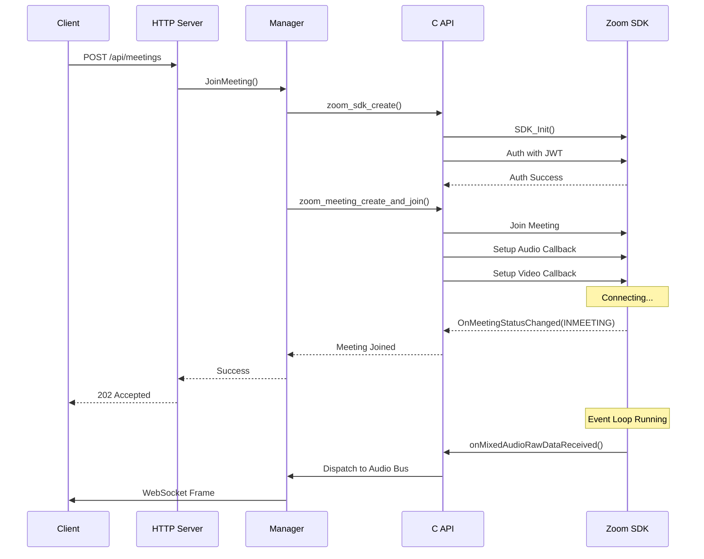
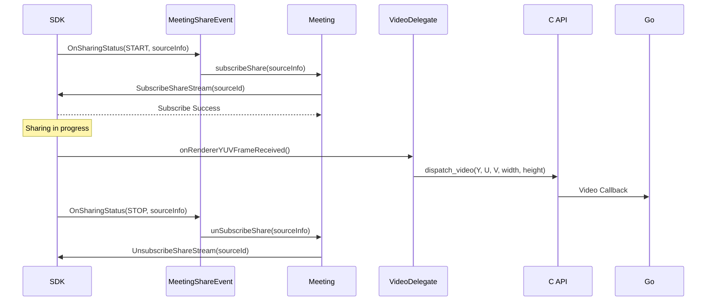

# Headless Meeting Bot

## 一、项目概述

### 1.1 项目简介

Headless Meeting Bot 是一个基于 Zoom SDK 的无界面会议机器人，可以在服务器环境下自动加入 Zoom 会议，实时采集音频和屏幕共享内容。该项目提供了多层次的 API 接口，支持 C、C++、Go 和 Java 等多种编程语言。

**核心功能：**
- 实时音频采集（混音、单路、共享音频）
- 屏幕共享内容采集（YUV I420 格式）（开发中）
- WebSocket 实时音频流分发
- RESTful API 会议管理
- 多会议并发支持

### 1.2 系统架构

```
┌─────────────────────────────────────────────────────────────┐
│                    客户端层 (Client Layer)                   │
├─────────────────────────────────────────────────────────────┤
│  REST API Client  │  WebSocket Client  │  CLI Application   │
└─────────────────────┬───────────────────────────────────────┘
                      │
┌─────────────────────▼───────────────────────────────────────┐
│                   Go 服务层 (Go Server)                      │
├─────────────────────────────────────────────────────────────┤
│  • HTTP/WebSocket 服务 (Gorilla)                            │
│  • Meeting Manager (会议管理)                                │
│  • Audio Bus (音频分发总线)                                  │
│  • Process Manager (进程隔离)                                │
└─────────────────────┬───────────────────────────────────────┘
                      │ CGo
┌─────────────────────▼───────────────────────────────────────┐
│                   C API 层 (C API Layer)                    │
├─────────────────────────────────────────────────────────────┤
│  • zoom_sdk_create()                                        │
│  • zoom_meeting_create_and_join()                           │
│  • zoom_meeting_set_audio_callback()                        │
│  • zoom_sdk_run_loop()                                      │
└─────────────────────┬───────────────────────────────────────┘
                      │
┌─────────────────────▼───────────────────────────────────────┐
│                C++ 核心层 (C++ Core Layer)                   │
├─────────────────────────────────────────────────────────────┤
│  • ZoomSDK (SDK 初始化与认证)                                 │
│  • Meeting (会议管理与事件处理)                                │
│  • AudioDelegate (音频数据回调)                               │
│  • VideoDelegate (视频数据回调)                               │
└─────────────────────┬───────────────────────────────────────┘
                      │
┌─────────────────────▼───────────────────────────────────────┐
│              Zoom SDK 层 (Zoom Meeting SDK)                 │
├─────────────────────────────────────────────────────────────┤
│  • Auth Service                                             │
│  • Meeting Service                                          │
│  • Audio Raw Data Helper                                    │
│  • Video Renderer                                           │
└─────────────────────────────────────────────────────────────┘
```

### 1.3 技术栈

| 层级 | 技术选型 | 说明 |
|-----|---------|------|
| **客户端** | HTTP/WebSocket | REST API + 实时音频流 |
| **服务层** | Go 1.23+ | 高并发、进程管理 |
| **绑定层** | CGo | Go-C 互操作 |
| **核心层** | C++17 | Zoom SDK 封装 |
| **SDK** | Zoom Meeting SDK 5.x | 官方 Linux SDK |
| **依赖** | jwt-cpp, picojson, Qt5 | JWT 认证、JSON 解析、UI 依赖 |

### 1.4 目录结构

```
headless-meeting-bot/
├── src/                   # C++ 核心实现
│   ├── c_api/             # C API 接口
│   ├── events/            # 事件处理器
│   ├── ZoomSDK.{h,cpp}    # SDK 封装
│   └── Meeting.{h,cpp}    # 会议管理
├── server/                # Go 服务实现
│   ├── cmd/               # Web APP 入口
│   ├── pkg/
│   │   ├── audio/        # 音频总线
│   │   ├── zoomsdk/      # SDK 绑定
│   │   └── server/       # HTTP/WS 服务
│   └── docker/           # Docker 部署
├── jna/                  # Java Bindings（JNA）
└── lib/                  # 第三方库
    ├── zoomsdk/          # Zoom SDK
    ├── jwt-cpp/          # JWT 库
    └── picojson/         # JSON 库
```

---

## 二、实现设计

### 2.1 架构设计决策

#### 2.1.1 分层设计原则

**设计思路：** 采用清晰的分层架构，每层职责单一，通过明确的接口进行交互。

```
应用层 (Application Layer)
    ↓ REST/WebSocket API
业务层 (Business Layer)
    ↓ Meeting Management
绑定层 (Binding Layer)
    ↓ C API
核心层 (Core Layer)
    ↓ C++ Wrapper
SDK层 (SDK Layer)
```

**优势：**
- 语言无关：通过 C API 支持多种语言绑定
- 易于测试：每层可独立测试
- 灵活部署：可选择单进程或多进程模式

**权衡：**
- 增加了调用层次，略微影响性能（约 5-10μs 开销）
- 跨语言调用需要数据序列化

#### 2.1.2 进程隔离设计

**问题：** Zoom SDK 不支持单进程内多个 SDK 实例，且 SDK 崩溃会导致整个进程退出。

**解决方案：** 提供两种运行模式

| 模式 | 实现类 | 适用场景 | 优缺点 |
|-----|--------|---------|--------|
| **单进程模式** | `Manager` | 单会议、开发测试 | ✓ 简单 ✓ 低延迟<br>✗ 无隔离 |
| **多进程模式** | `ProcessManager` | 多会议、生产环境 | ✓ 隔离 ✓ 稳定<br>✗ 复杂 |

**多进程架构：**

```
┌──────────────────────────────────────────┐
│           主进程 (Main Process)           │
│  ┌────────────┐      ┌──────────────┐    │
│  │   HTTP     │      │   Audio Bus  │    │
│  │  Server    │◄────►│  (Shared)    │    │
│  └────────────┘      └──────────────┘    │
│         │                                │
│         ▼                                │
│  ┌────────────────────────────────────┐  │
│  │     Process Manager                │  │
│  │  • Fork worker processes           │  │
│  │  • Monitor health                  │  │
│  │  • IPC via stdio/shared memory     │  │
│  └─────────┬──────────────┬───────────┘  │
└────────────┼──────────────┼──────────────┘
             │              │
      ┌──────▼─────┐  ┌────▼───────┐
      │  Worker 1  │  │  Worker 2  │
      │ Meeting A  │  │ Meeting B  │
      │ (Isolated) │  │ (Isolated) │
      └────────────┘  └────────────┘
```

### 2.2 核心流程设计

#### 2.2.1 会议加入流程



#### 2.2.2 音频流分发流程

**设计目标：** 低延迟、高吞吐、支持多订阅者过滤

```
┌─────────────┐
│  Zoom SDK   │
│ Audio Data  │
└──────┬──────┘
       │ onAudioRawDataReceived()
       ▼
┌─────────────────────────────────┐
│     C++ AudioDelegate           │
│  • Receives PCM data            │
│  • Type: Mixed/OneWay/Share     │
└──────┬──────────────────────────┘
       │ zoom_meeting_dispatch_audio()
       ▼
┌─────────────────────────────────┐
│        C API Layer              │
│  • Callback dispatch            │
└──────┬──────────────────────────┘
       │ CGo callback
       ▼
┌─────────────────────────────────┐
│      Go Audio Bus               │
│  ┌───────────────────────────┐  │
│  │  Publish(meetingID, frame)│  │
│  └───────┬───────────────────┘  │
│          │                      │
│    ┌─────▼────┐   ┌──────────┐  │
│    │ Filter   │   │  Stats   │  │
│    │ Routing  │   │  Track   │  │
│    └─────┬────┘   └──────────┘  │
└──────────┼──────────────────────┘
           │
    ┌──────▼──────┬──────────┐
    │             │          │
┌───▼────┐  ┌────▼───┐  ┌──▼─────┐
│ Sub 1  │  │ Sub 2  │  │ Sub N  │
│ WS Conn│  │ WS Conn│  │ WS Conn│
└────────┘  └────────┘  └────────┘
```

**过滤机制：**

```javascript
const ws = new WebSocket(
  'ws://localhost:8080/ws/audio/1234567890?user_id=16778240,16782336'
);
```
另外支持通过type去过滤音频类型: 
- mixed: 混合音频
- one_way: 单路音频
- share: 共享视频音频


#### 2.2.3 屏幕共享捕获流程

**自动订阅机制：**



### 2.3 关键设计细节

#### 2.3.1 JWT 认证

Zoom SDK 使用 JWT 进行认证，token 有效期通常为 24 小时。

**注意事项：**
- JWT 过期前需要重新生成并重新认证
- 当前实现为简化设计，每次创建 SDK 时生成新 JWT
- 因为会议时间不会太长，暂不实现自动刷新机制

#### 2.3.2 音频数据格式

**Zoom SDK 输出格式：**
- 采样率：32kHz（可配置）
- 声道：单声道（1 channel）
- 位深度：16-bit signed integer (S16LE)
- 字节序：Little-endian

```
Frame Structure:
┌────────────┬─────────────┬──────────────────┐
│ Audio Type │   User ID   │   PCM Data       │
│  (8 bytes) │  (8 bytes)  │   (N bytes)      │
│  uint64_le │  uint64_le  │   S16LE stereo   │
└────────────┴─────────────┴──────────────────┘
```

#### 2.3.3 内存管理与对象生命周期

**C++ 层：**
- `ZoomSDK` 和 `Meeting` 使用智能指针管理
- Event 对象作为 `unique_ptr` 成员
- Raw data delegates 手动管理（SDK 回调要求）

**C API 层：**
- 使用 opaque handles（`void*`）
- 调用方负责 `_create` 和 `_destroy` 配对

**Go 层：**
- CGo handles 存储在 `sync.Map` 中
- 使用 finalizer 确保资源释放
- Audio frames 使用对象池减少 GC 压力


### 2.4 技术权衡与限制

#### 2.4.1 单 SDK 实例限制

**限制：** Zoom SDK 使用全局单例模式，单个进程只能有一个 SDK 实例。

**影响：**
- 单进程模式下只能加入一个会议
- 多会议场景必须使用多进程模式

**设计决策：**
- 默认提供单进程 `Manager`（简单场景）
- 提供多进程 `ProcessManager`（生产环境）
- 通过统一接口 `MeetingManager` 屏蔽实现差异

#### 2.4.2 音频延迟

**延迟来源分析：**

| 环节 | 延迟 | 说明 |
|-----|------|------|
| Zoom SDK | 20-50ms | 网络抖动、解码 |
| C++ → C API | <1ms | 函数调用 |
| C API → Go | 5-10ms | CGo 调用 |
| Audio Bus | 1-5ms | 内存拷贝、路由 |
| WebSocket | 10-50ms | 网络传输 |
| BufferQueue | 100ms | syscall 性能优化 |
| **总计** | **200ms** | 端到端延迟 |

**优化策略：**
- 使用非阻塞通道避免等待
- Frame pool 减少内存分配
- 批量发送减少系统调用，动态缓冲区长度，固定buffer延迟为100ms

#### 2.4.3 进程间通信开销

**多进程模式的开销：**
- 进程创建：~100ms
- 内存占用：每个 worker ~240MB（Zoom SDK + Qt）
- IPC 延迟：~1ms（stdio）或 <0.1ms（shared memory）

**当前实现：**
- 使用 stdio 进行 IPC（简单可靠）
- 每个 worker 独立的 Audio Bus

**未来优化方向：**
- 考虑使用 shared memory 降低 IPC 延迟
- Audio Bus 放在主进程，避免数据拷贝

#### 2.4.4 视频数据量 (WIP)

**数据量估算：**
- 1080p YUV420: 1920×1080×1.5 ≈ 3MB/frame
- 30fps: 90MB/s
- 带宽需求：720Mbps (未压缩)

**当前设计：**
- 仅捕获屏幕共享（按需订阅）
- 不捕获摄像头视频（降低资源消耗）
- 视频数据由应用层自行压缩（H.264/VP8）

**限制：**
- WebSocket 不适合传输原始视频
- 建议使用本地存储或外部转码服务

---

## 三、开发者指南

### 3.1 环境准备

#### 3.1.1 系统依赖

```bash
apt-get update && \
apt-get install -y build-essential cmake
apt-get install -y pkgconf
apt-get install -y gtkmm-3.0

apt-get install -y --no-install-recommends --no-install-suggests \
    libx11-xcb1 \
    libxcb-xfixes0 \
    libxcb-shape0 \
    libxcb-shm0 \
    libxcb-randr0 \
    libxcb-image0 \
    libxcb-keysyms1 \
    libxcb-xtest0


# Go 环境
wget https://go.dev/dl/go1.23.11.linux-amd64.tar.gz
sudo tar -C /usr/local -xzf go1.23.11.linux-amd64.tar.gz
export PATH=$PATH:/usr/local/go/bin
```

#### 3.1.2 Zoom SDK 配置

1. 从 [Zoom Marketplace](https://marketplace.zoom.us/) 获取 SDK Key 和 Secret
2. 下载 Zoom Meeting SDK for Linux
3. 解压到 `lib/zoomsdk/`

### 3.2 构建指南

#### 3.2.1 构建 C/C++ 核心

```bash
cd src/build
cmake ..
make -j$(nproc)

# 输出文件
# - headless_zoom_bot       # C++ demo
# - headless_zoom_bot_c     # C API demo
# - libzoomsdk_c.so         # C API 动态库
```

#### 3.2.2 构建 Go 服务

```bash
cd server
./build.sh

# 或手动构建
go build -o headless-meeting-bot cmd/headless-meeting-bot/*.go
```

#### 3.2.3 Docker 构建

```bash
cd server/docker

# 编译镜像（包含构建环境）
./docker-build.sh build
```
部署参见下面 章节3.4

### 3.3 API 使用指南

#### 3.3.1 C API 快速开始

```c
#include "zoom_sdk_c.h"

// 音频回调
void on_audio(MeetingHandle meeting, const void* data, int length, 
              int type, unsigned int user_id) {
    // 处理音频数据
    printf("Audio: type=%d, user=%u, len=%d\n", type, user_id, length);
}

int main() {
    // 1. 创建 SDK
    ZoomSDKHandle sdk = zoom_sdk_create(
        getenv("ZOOM_SDK_KEY"),
        getenv("ZOOM_SDK_SECRET")
    );
    
    // 2. 加入会议
    MeetingHandle meeting = zoom_meeting_create_and_join(
        sdk,
        "1234567890",        // meeting_id
        "password",          // password
        "My Bot",            // display_name
        NULL,                // join_token
        1,                   // enable_audio
        0                    // enable_video
    );
    
    // 3. 设置回调
    zoom_meeting_set_audio_callback(meeting, on_audio);
    
    // 4. 运行事件循环
    zoom_sdk_run_loop();  // 阻塞直到收到信号
    
    // 5. 清理
    zoom_meeting_destroy(meeting);
    zoom_sdk_destroy(sdk);
    
    return 0;
}
```

#### 3.3.2 Go Server REST API

**加入会议**
https://go.dev/dl/go1.23.11.linux-amd64.tar.gz
```bash
curl -X POST http://localhost:8080/api/meetings \
  -H "Content-Type: application/json" \
  -d '{
    "meeting_id": "1234567890",
    "password": "password",
    "display_name": "Recording Bot",
    "join_token": ""
  }'

# Response: 202 Accepted
{
  "status": "joining"
}
```

**查询会议状态**

```bash
curl http://localhost:8080/api/meetings/1234567890
# Response: 200 OK
{
  "meeting_id": "1234567890",
  "status": "MEETING_STATUS_INMEETING",
  "error": null,
  "stats": {
    "frames_received": 12500,
    "bytes_received": 1024000
  }
}
```

**离开会议**

```bash
curl -X DELETE http://localhost:8080/api/meetings/1234567890

# Response: 200 OK
{
  "status": "left"
}
```

**列出所有会议**

```bash
curl http://localhost:8080/api/meetings

# Response: 200 OK
[
  {
    "meeting_id": "1234567890",
    "status": "MEETING_STATUS_INMEETING"
  }
]
```

#### 3.3.3 WebSocket 音频流

**连接音频流**

```javascript
// 连接到指定会议的音频流
const ws = new WebSocket(
  'ws://localhost:8080/ws/audio/1234567890?type=one_way'
);

ws.binaryType = 'arraybuffer';

// 1. 接收音频格式信息
ws.onmessage = (event) => {
  if (typeof event.data === 'string') {
    const msg = JSON.parse(event.data);
    
    if (msg.type === 'audio_format') {
      console.log('Audio format:', msg);
      // { sample_rate: 32000, channels: 1, sample_format: "s16le" }
    }
    
    if (msg.type === 'heartbeat') {
      console.log('Heartbeat:', msg.timestamp);
    }
    
    if (msg.type === 'error') {
      console.error('Error:', msg.error);
    }
  } 
  // 2. 接收二进制音频帧
  else {
    const buffer = new Uint8Array(event.data);
    const view = new DataView(buffer.buffer);
    
    // 解析帧头 (16 bytes)
    const audioType = view.getBigUint64(0, true);  // little-endian
    const userId = view.getBigUint64(8, true);
    
    // 解析 PCM 数据
    const pcmData = new Int16Array(
      buffer.buffer, 
      16,  // skip header
      (buffer.length - 16) / 2
    );
    
    console.log(`Frame: type=${audioType}, user=${userId}, samples=${pcmData.length}`);
    
    // 播放或保存音频...
  }
};

ws.onerror = (error) => {
  console.error('WebSocket error:', error);
};

ws.onclose = () => {
  console.log('WebSocket closed');
};
```

**查询参数说明**

| 参数 | 类型 | 说明 | 默认值 |
|-----|------|------|--------|
| `type` | string(optional) | 音频类型过滤：`mixed`, `one_way`, `share` | 全部 |
| `user_id` | string(optional) | 用户 ID 过滤（逗号分隔）| 全部 |
| `queue_size` | int(optional) | 缓冲队列大小 | 1000 |

**音频帧内类型flag说明**

| Type | Value | 说明 |
|------|-------|------|
| Mixed | 0 | 混音音频（所有参与者） |
| One-Way | 1 | 单路音频（单个参与者） |
| Share | 2 | 共享音频（屏幕共享） |

**Python 客户端示例**

```python
import asyncio
import websockets
import struct
import wave

async def record_audio(meeting_id, output_file):
    uri = f"ws://localhost:8080/ws/audio/{meeting_id}?type=mixed"
    
    async with websockets.connect(uri) as ws:
        # 创建 WAV 文件
        wav = wave.open(output_file, 'wb')
        wav.setnchannels(1)
        wav.setsampwidth(2)  # 16-bit
        wav.setframerate(32000)
        
        async for message in ws:
            if isinstance(message, str):
                # 文本消息（JSON）
                import json
                msg = json.loads(message)
                print(f"Message: {msg}")
            else:
                # 二进制音频帧
                # 解析帧头
                audio_type, user_id = struct.unpack('<QQ', message[:16])
                pcm_data = message[16:]
                
                # 写入 WAV 文件
                wav.writeframes(pcm_data)
                
                print(f"Frame: type={audio_type}, user={user_id}, "
                      f"bytes={len(pcm_data)}")
        
        wav.close()

# 运行
asyncio.run(record_audio("1234567890", "meeting.wav"))
```

### 3.4 部署指南

#### 3.4.1 本地部署

**1. 准备环境**

```bash
# 设置环境变量
export ZOOM_SDK_KEY="your_key"
export ZOOM_SDK_SECRET="your_secret"
export HTTP_ADDR=":8080"
export LOG_LEVEL="info"

# 配置库路径
export LD_LIBRARY_PATH="/path/to/lib/zoomsdk:$LD_LIBRARY_PATH"
```

**2. 运行服务**

```bash
cd server
./run.sh
```

#### 3.4.2 Docker 部署


**1. Docker 内编译**

```bash
./docker/docker-build.sh build
```

**2. 运行 Docker**

```bash
# 构建镜像
./docker/docker-build.sh deploy

# 运行容器
docker run -d \
  --name meeting-bot \
  -p 8080:8080 \
  -e ZOOM_SDK_KEY="your_key" \
  -e ZOOM_SDK_SECRET="your_secret" \
  -v $(pwd)/recordings:/app/recordings \
  headless-meeting-bot:latest
```

**Docker Compose 配置参考**

```yaml
version: '3.8'

services:
  meeting-bot:
    image: headless-meeting-bot:latest
    container_name: meeting-bot
    restart: unless-stopped
    ports:
      - "8080:8080"
    environment:
      - ZOOM_SDK_KEY=${ZOOM_SDK_KEY}
      - ZOOM_SDK_SECRET=${ZOOM_SDK_SECRET}
      - HTTP_ADDR=:8080
      - LOG_LEVEL=info
    healthcheck:
      test: ["CMD", "curl", "-f", "http://localhost:8080/health"]
      interval: 30s
      timeout: 10s
      retries: 3
    deploy:
      resources:
        limits:
          cpus: '2.0'
          memory: 4G
        reservations:
          cpus: '0.5'
          memory: 1G
```

---

## 四、附录

### 4.1 完整 API 参考

#### C API

| 函数 | 说明 |
|-----|------|
| `zoom_sdk_create(key, secret)` | 创建并初始化 SDK |
| `zoom_sdk_destroy(handle)` | 销毁 SDK |
| `zoom_meeting_create_and_join(...)` | 创建并加入会议 |
| `zoom_meeting_destroy(handle)` | 离开并销毁会议 |
| `zoom_meeting_get_status(handle)` | 获取会议状态 |
| `zoom_meeting_set_audio_callback(handle, cb)` | 设置音频回调 |
| `zoom_meeting_set_video_callback(handle, cb)` | 设置视频回调 |
| `zoom_sdk_run_loop()` | 运行事件循环 |
| `zoom_sdk_stop_loop()` | 停止事件循环 |

#### REST API

| 端点 | 方法 | 说明 |
|-----|------|------|
| `/api/meetings` | POST | 加入会议 |
| `/api/meetings` | GET | 列出所有会议 |
| `/api/meetings/{id}` | GET | 获取会议状态 |
| `/api/meetings/{id}` | DELETE | 离开会议 |
| `/ws/audio/{id}` | WS | 音频流 WebSocket |
| `/health` | GET | 健康检查 |

### 4.2 配置参数

#### 环境变量

| 变量 | 必需 | 默认值 | 说明 |
|-----|------|--------|------|
| `ZOOM_SDK_KEY` | 是 | - | Zoom SDK Key |
| `ZOOM_SDK_SECRET` | 是 | - | Zoom SDK Secret |
| `HTTP_ADDR` | 否 | `:8080` | 服务监听地址 |
| `LOG_LEVEL` | 否 | `info` | 日志级别 |
| `LD_LIBRARY_PATH` | 是 | - | 动态库路径 |

#### 音频配置

| 参数 | 值 | 说明 |
|-----|---|------|
| 采样率 | 32000 Hz | WebSocket 输出 |
| 声道数 | 1 (mono) | WebSocket 输出 |
| 位深度 | 16-bit | S16LE 格式 |
| 帧大小 | ~3ms | 100 samples @ 32kHz |

### 4.3 错误码

| 错误码 | HTTP 状态 | 说明 |
|--------|----------|------|
| `MEETING_ALREADY_EXISTS` | 409 | 会议已存在 |
| `MEETING_NOT_FOUND` | 404 | 会议未找到 |
| `SDK_INIT_FAILED` | 500 | SDK 初始化失败 |
| `AUTH_FAILED` | 401 | 认证失败 |
| `JOIN_MEETING_FAILED` | 500 | 加入会议失败 |
| `INVALID_MEETING_ID` | 400 | 会议 ID 无效 |

### 4.4 性能指标

| 指标 | 值 | 说明 |
|-----|---|------|
| 音频延迟 | 200ms | 端到端延迟 |
| 并发会议 | ~10 (单进程) | 受 SDK 限制 |
| WebSocket 连接 | 100+ | 每个会议 |
| 内存占用 | ~240MB | 每个会议 (含 SDK) |
| CPU 占用 | ~5% | 单个会议 @ 2.4GHz |

### 4.5 许可证

本项目使用 MIT License。Zoom SDK 受 Zoom 使用条款约束。

---

## 变更历史

| 版本 | 日期 | 变更 |
|-----|------|------|
| 1.0.0 | 2025-10 | 初始版本 |

---


